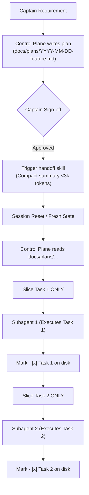

# Writing Implementation Plans (`writing-plans`)

> *"Assume the implementer has zero context and questionable taste. Give them exact files, exact signatures, full code blocks, and concrete test assertions."*

Implementation planning is the mandatory bridge between system requirements and autonomous agent execution. The goal of an implementation plan is to decompose complex features, refactors, and architectural migrations into self-contained, bite-sized units of work that can be executed with zero ambiguity, zero guesswork, and zero token bloat.

---

## 1. Core Philosophy: The Plan-First Invariant

AI coding agents excel at focused execution within well-defined boundaries, but degrade rapidly when forced to plan, explore, and write complex code simultaneously. 

### Core Tenets
1. **Zero Context, Questionable Taste Assumption:** Always author plans assuming the downstream worker has zero memory of previous conversations, zero intuition about architectural subtleties, and an inclination toward speculative over-engineering unless strictly constrained.
2. **The Plan-First Gate (The Architectural Impact & Ambiguity Standard):** Implementation plans are triggered **strictly by architectural consequence, non-obvious design, or explicit Captain direction**—never by blanket file counts. Authoring a plan in `docs/plans/` is required for:
   - **Plan-Required Triggers (MUST author plan in `docs/plans/` and secure Captain sign-off):**
     1. *Explicit Captain Command:* When the user explicitly requests or insists on a plan (`"write a plan"`, `"plan this"`, `/plan`, etc.).
     2. *From-Scratch Creation:* Creating brand new systems, services, modules, or features from a blank slate.
     3. *Large Architectural Refactors:* Foundational rewrites, cross-subsystem migrations, replacing core abstractions or frameworks.
     4. *Database & Complex Queries:* Schema changes, table migrations, column alterations, state machine transitions, or complex non-trivial query pipelines.
     5. *Core Business Logic & Invariants:* Mission-critical calculations, payment/financial flows, authentication/authorization pipelines, sensitive domain logic.
     6. *High Ambiguity / Multi-Option Decisions:* Any task with multiple viable architectural trade-offs where the path forward is not obvious.
   - **Plan-Exempt Triggers (Bypass `writing-plans` — Direct Execution):**
     1. *Design, Styling & Color Changes:* Cosmetic tweaks, theme adjustments, Tailwind class updates, color token changes—**even if affecting dozens of files** (e.g. updating color styling across 15 templates).
     2. *Mechanical & Repetitive Refactors:* Symbol renames, mass import updates, obvious boilerplate extensions across multiple files.
     3. *Obvious & Singular Path Tasks:* Routine bug fixes with established root causes, straightforward CRUD additions following existing codebase patterns, simple configuration changes.
     4. *Anything Obvious:* Where the implementation path is self-evident and requires zero architectural debate.
3. **Externalized Disk State:** The implementation plan is saved directly to disk at:
   ```
   docs/plans/YYYY-MM-DD-<feature-name>.md
   ```
   This disk file is the single source of truth. Task progress is tracked live using markdown checkboxes (`- [ ]` and `- [x]`).
4. **Separation of Planning and Execution:** Authoring the plan is a discrete phase. Never mix planning iterations with active codebase modifications.
5. **Anti-Slop Task Eligibility Gate:** Every task defined in the plan must satisfy the Anti-Slop Task Eligibility Standard: closed-loop verifiability, anti-gobble file scoping ($\le 3$ files), and domain criticality categorization (`[HUMAN-CORE / AI-TEST]` vs. `[AUTONOMOUS-SHIP]`).

---

## 2. Engineering Governance: Strict Pairing with Ponytail

Every implementation plan created under `writing-plans` MUST strictly pair with the [`ponytail`](../ponytail/SKILL.md) anti-overengineering framework.

### The 7-Rung Ladder in Plan Design
Before specifying any task or component in the plan, evaluate proposed solutions through the **7-Rung Decision Ladder** in strict descending order:
$\rightarrow$ Consult [`ponytail`](../ponytail/SKILL.md) for the complete decision tree (Rung 1: YAGNI → Rung 2: Codebase Reuse → Rung 3: Stdlib First → Rung 4: Platform Natives → Rung 5: Zero New Dependencies → Rung 6: Inline Clarity → Rung 7: Minimum Working Diff).

### The Non-Negotiable Safety Invariant
While minimizing code diffs, the plan must never compromise on the 5 safety pillars:
- **Security:** Parameterized queries, input sanitization, CSRF/CORS compliance, zero secrets in source.
- **Runtime Validation:** Schema validation at all network/IO boundaries (`zod`, `valibot`, `FormRequest`, `pydantic`).
- **Error Handling:** Explicit failure modes, status codes, and clear diagnostics (no empty `catch` blocks).
- **Accessibility:** Semantic HTML elements, ARIA labels, keyboard navigability.
- **Automated Tests:** 100% test pass rate across existing test suites and newly required business logic tests (governed by the Pragmatic Testing Standard).

---

## 3. The "No Placeholders" Mandate (Zero Hand-Waving)

A plan with placeholders is not an implementation plan—it is an unfinished thought. Downstream subagents will hallucinate missing details or invent incompatible interfaces if placeholders are permitted.

### Strictly Prohibited
❌ `"TODO: implement later"`  
❌ `"TBD / figure out in implementation"`  
❌ `"Add appropriate error handling"`  
❌ `"Write unit tests for the above"` (without the test code)  
❌ `"Wire up the database query"` (without the exact query or ORM call)  
❌ Pseudo-code or hand-waving bullet points for code logic  

### Mandatory Requirement
Every code task MUST include:
- **Exact File Paths:** Absolute or workspace-relative paths for all files created, modified, or tested.
- **Target Lines / Symbols:** Specific classes, functions, or line ranges being targeted in existing files.
- **Full Implementation Code Blocks:** The exact code to be written, including imports, types, and logic.
- **Full Test Code Blocks (When Test-Required):** Complete, runnable test suites asserting concrete behaviors, inputs, and expected outputs for business logic, calculations, and invariants. For test-exempt tasks (UI, CRUD, glue), explicitly specify "Test-Exempt (Verified via [compiler/linter/typecheck])".
- **Exact Shell Commands:** The precise verification commands to execute and their expected outputs.

---

## 4. Task Right-Sizing & Interface Contracts

To prevent execution failures, tasks must be broken down into atomic, right-sized units with clear interface boundaries.

### Right-Sizing Guidelines
- **Granularity:** Each task should represent approximately 15 to 30 minutes of subagent execution work.
- **Single Responsibility:** A task should touch a small, cohesive set of files (ideally 1–2 production files plus their corresponding test file when test-required).
- **Independent Verifiability:** Every individual task must end with a concrete passing verification step (passing test suite for business logic; successful lint/typecheck/compile for test-exempt tasks) before moving to the next task.

### Anti-Slop Task Eligibility Checklist
Every task drafted in an implementation plan MUST pass the 3-part Anti-Slop Task Eligibility Check before dispatch:

- **Check 1: Is it closed-loop? (Verifiability Mandate)**  
  An autonomous execution (`SHIP`) task is strictly ineligible for dispatch unless accompanied by an explicit, deterministic automated verification command (unit/feature test runner, compiler, or deterministic CLI check). If a task cannot self-verify in an automated loop, it must be human-driven or shaped as a read-only advisory spike (`SCOUT`).
- **Check 2: Is it anti-gobble? (Context Scope Invariant)**  
  Every task must be scoped to $\le 3$ files (typically 1–2 production files plus their companion test file). The agent must never scan or ingest an entire codebase into context. On existing codebases, tasks rely strictly on explicit seam contracts (`Consumes` / `Produces`) and micro-specs that isolate the targeted integration seam.
- **Check 3: Is it mission-critical? (Domain Boundary Invariant)**  
  High-stakes core domain logic—including monetary calculations, auth/cryptography, sensitive database migrations, and proprietary core algorithmic IP—is strictly owned and authored by the human engineer (the Captain).  
  - If **Yes** (mission-critical): Tag as `[HUMAN-CORE / AI-TEST]`. The AI is restricted to authoring test harnesses, edge-case mocks, and conducting reviews, while the Captain authors the core logic.  
  - If **No** (non-critical domain such as dashboards, tooling, CRUD scaffolding, connectors, and plumbing): Tag as `[AUTONOMOUS-SHIP]` for autonomous subagent implementation.
- **Reproduction-First Bug Protocol:**  
  For bug fix tasks, the agent is strictly prohibited from touching production code until a standalone reproduction test case reliably fails in a closed loop.

### Interface Contracts: Consumes & Produces
To eliminate integration bugs when tasks are executed by separate subagents, every task specification must declare its interface contracts:

- **`Consumes`:** The exact types, interfaces, schemas, or function signatures imported from earlier tasks or existing codebase modules.
- **`Produces`:** The exact types, interfaces, schemas, functions, or endpoints created by this task that will be consumed by subsequent tasks.

```markdown
#### Interface Contract
- **Consumes:**
  ```typescript
  import { UserRecord } from '@/types/user';
  import { DbClient } from '@/db/client';
  ```
- **Produces:**
  ```typescript
  export interface BillingSummary {
    userId: string;
    totalDueCents: number;
    currency: 'usd';
  }
  export function calculateBillingSummary(user: UserRecord, db: DbClient): Promise<BillingSummary>;
  ```
```

#### Machine Grammar Pairing: `task-contract.yaml`
Every task defined in an implementation plan pairs with [`grammars-and-constrained-sampling`](../grammars-and-constrained-sampling/SKILL.md) and MUST conform to the canonical machine contract defined at [`.agents/schemas/task-contract.yaml`](../../../schemas/task-contract.yaml):
- **Canonical Schema:** [`.agents/schemas/task-contract.yaml`](../../../schemas/task-contract.yaml)
- **Zero Hand-Waving:** Eliminates conversational ambiguity by strictly enforcing required schema properties (`task_id`, `title`, `eligibility`, `scope`, `consumes`, `produces`, `verification`).
- **Context-Sliced Subagent Briefs:** Slices the task contract directly into subagent briefs without conversational baggage.
- **Closed-Loop Verification Contract:** Locks the exact verification command and expected exit code into the machine contract.

### The Verification & TDD Cycle (Pragmatic Testing Standard)
Every code task in the plan must specify its closed-loop verification steps. Task test requirements are governed strictly by the **Pragmatic Testing Standard** documented in [`.agents/skills/engineering/tdd/SKILL.md`](../../engineering/tdd/SKILL.md) and [`AGENTS.md §8`](../../../../AGENTS.md#8-anti-slop-task-eligibility-standard-pre-flight-audit-checklist):

- **For Test-Required Tasks:** (Business logic, financial calculations, mission-critical invariants, shared API contracts, and bug reproductions as defined in [`tdd`](../../engineering/tdd/SKILL.md)). Specify the 5 TDD steps (Write Failing Test → Verify Failure → Minimal Implementation → Verify Pass → Static Checks).
- **For Test-Exempt Tasks:** (UI templates, styling, routine CRUD, config glue). Specify the 3-step verification cycle (Minimal Implementation → Deterministic Verification via compiler/linter → Visual/Seam Confirmation).

---

## 5. Context Hygiene, Handoffs, and Subagent Context Slicing

### The Context Degradation Problem
As an AI conversation extends, conversational history accumulates dozens of tool calls, exploratory outputs, and intermediate reasoning steps (often 50k–100k+ tokens). In large contexts:
- Model attention thins, leading to missed instructions.
- Instruction drift and hallucinated APIs increase.
- Tool call latency and token costs soar.

ACON solves context degradation through **Externalized Disk State**, **Context Handoffs**, and **Subagent Context Slicing**.



### Externalized Disk State
The plan file `docs/plans/YYYY-MM-DD-<feature-name>.md` lives in the repository on disk.
- It survives agent session restarts, process crashes, and harness context limits.
- When an execution worker completes a task, the task's checkbox is updated to `- [x]` in the file.
- Any agent joining the project can immediately view the exact baseline and remaining work by inspecting the plan file.

### Session Resets via `handoff`
When the planning phase concludes and the Captain signs off on the plan:
1. The Control Plane activates [`handoff`](../handoff/SKILL.md) to generate a high-density, low-token summary (<3k tokens) referencing the plan file path.
2. The Captain or Control Plane triggers a session reset (e.g., `/clear` or starting a fresh command thread).
3. The new session loads with zero conversational baggage, reads `docs/plans/YYYY-MM-DD-<feature-name>.md`, and immediately begins autonomous crew flight.

### Subagent Context Slicing (The Slicing Rule)
When the Control Plane dispatches a specialist worker via `invoke_subagent`:
- **NEVER dump the entire 500-line plan or the multi-turn conversation history into the subagent brief.**
- **Slice ONLY Task N:** The prompt brief for Worker N must contain strictly:
  1. The objective of Task N.
  2. The specific file boundaries (`Create`, `Modify`, `Test`).
  3. The `Consumes` and `Produces` interface contracts.
  4. The concrete TDD steps and code blocks for Task N.
  5. The verification commands and Ponytail constraints.
- Keeping subagent briefs lean (<2k tokens) guarantees laser focus, avoids boundary violations, and eliminates hallucinations.

---

## 6. Canonical Implementation Plan Template

When authoring a plan in `docs/plans/YYYY-MM-DD-<feature-name>.md`, use the following standard structure:

```markdown
# Implementation Plan: [Feature Name]

- **Plan File:** `docs/plans/YYYY-MM-DD-[feature-name].md`
- **Author:** [Control Plane / Specialist Name]
- **Date:** YYYY-MM-DD
- **Status:** [Draft | In Review | Approved | In Progress | Completed]
- **Target Branch:** `feature/[feature-name]`

---

## 1. Context & Objective
[Brief explanation of the requirement, user problem, or architectural goal. 1–2 paragraphs.]

---

## 2. Architecture & Design Decisions
- **Approach:** [High-level architectural approach chosen and rationale]
- **Alternatives Considered:** [1–2 alternatives rejected and why, referencing Ponytail rungs]
- **Affected Subsystems:** [List of services, packages, directories impacted]

---

## 3. Engineering Constraints & Anti-Slop Alignment
- **Anti-Slop Eligibility Check:**
  - [ ] Closed-Loop Verifiable: Explicit deterministic verification command specified for every task.
  - [ ] Anti-Gobble Scoping: Each task strictly bounded to $\le 3$ files with explicit seam contracts.
  - [ ] Mission-Critical Partitioning: High-stakes domain logic isolated as `[HUMAN-CORE / AI-TEST]`; non-critical as `[AUTONOMOUS-SHIP]`.
- **Ponytail 7-Rung Ladder:**
  - **YAGNI Check:** [What speculative features or abstractions were deliberately omitted]
  - **Dependencies:** [Explicit confirmation: 0 new dependencies, or Captain-approved exception]
  - **Platform/Stdlib:** [Natives utilized instead of external packages]
  - **Safety Invariants:** [Validation schemas, security measures, test coverage targets]

---

## 4. Pre-requisites & Environment Setup
```bash
# Commands needed before running tasks (e.g. database migration, fixture setup)
```

---

## 5. Implementation Tasks

### - [ ] Task 1: [Short Action-Oriented Title] `[AUTONOMOUS-SHIP | HUMAN-CORE / AI-TEST]`
- **Anti-Slop Eligibility Check:**
  - [x] Closed-Loop: Yes (automated verification command specified)
  - [x] Anti-Gobble: Yes ($\le 3$ files: 1 create, 1 modify, 1 test)
  - [x] Mission-Critical: No (`[AUTONOMOUS-SHIP]`) / Yes (`[HUMAN-CORE / AI-TEST]`)
- **Goal:** [One-sentence objective of this task]
- **Files:**
  - `Create:` `src/domain/billing/calculator.ts`
  - `Modify:` `src/domain/billing/types.ts`
  - `Test:` `tests/domain/billing/calculator.test.ts`
- **Interface Contract:**
  - `Consumes:` `import { AccountTier } from '@/domain/account/types';`
  - `Produces:` `export function calculateProration(tier: AccountTier, daysRemaining: number): number;`

#### Step 1: Write Failing Test
```typescript
// tests/domain/billing/calculator.test.ts
import { describe, it, expect } from 'vitest';
import { calculateProration } from '@/domain/billing/calculator';

describe('calculateProration', () => {
  it('calculates correct remaining balance for pro tier', () => {
    const result = calculateProration('PRO', 15);
    expect(result).toBe(1500);
  });
});
```

#### Step 2: Verify Test Failure
```bash
npx vitest run tests/domain/billing/calculator.test.ts
# Expected output: ReferenceError: calculateProration is not defined
```

#### Step 3: Minimal Implementation
```typescript
// src/domain/billing/calculator.ts
import { AccountTier } from '@/domain/account/types';

export function calculateProration(tier: AccountTier, daysRemaining: number): number {
  const dailyRateCents = tier === 'PRO' ? 100 : 50;
  return dailyRateCents * daysRemaining;
}
```

#### Step 4: Verify Test Passes
```bash
npx vitest run tests/domain/billing/calculator.test.ts
# Expected output: Tests: 1 passed, 1 total
```

#### Step 5: Verification & Quality Checks
```bash
npx eslint src/domain/billing/calculator.ts
npx tsc --noEmit
```

---

### - [ ] Task 2: [Short Action-Oriented Title]
... [Repeated structure for Task 2, Task 3, etc.]

---

## 6. Integration & Acceptance Verification
- [ ] Complete test suite passes: `npm test` or `php artisan test`
- [ ] Linter & Typecheck: `npm run lint && npm run typecheck`
- [ ] End-to-end user scenario validation:
  ```bash
  # Concrete curl command, CLI invocation, or browser test
  ```

---

## 7. Rollback & Risk Strategy
- **Failure Recovery:** [How to revert cleanly if verification fails]
- **Data Migration Impact:** [Notes on schema reversibility if applicable]
```

---

## 7. Authoring Workflow: Step-by-Step

When a task triggers the Plan-First Gate under the Architectural Impact & Ambiguity Standard, follow this operational cadence:

1. **Intake & Intent Extraction:**  
   Run `prompt-master` 9-dimension extraction. If forks or ambiguities exist, trigger `grill-me` for quick alignment.
2. **Read-Only Codebase Scouting:**  
   Dispatch a `Codebase Scout` via `invoke_subagent` to locate existing patterns, utility functions, test conventions, and integration seams. Never guess file contents or function signatures.
3. **Draft Implementation Plan:**  
   Write the complete plan using the template above, enforcing the Ponytail ladder, interface contracts, and complete code blocks. Save to `docs/plans/YYYY-MM-DD-<feature-name>.md`.
4. **Self-Audit against Mandates:**  
   - **Anti-Slop Task Eligibility Check:**
     - *Is it closed-loop?* (Explicit automated verification command required for every execution task).
     - *Is it anti-gobble?* (Max 3 files per task; explicit seam contracts; zero whole-codebase scans).
     - *Is it mission-critical?* (If high-stakes core logic, marked as `[HUMAN-CORE / AI-TEST]` where AI provides test harness and human implements core logic).
     - *Reproduction-first?* (For bug tasks, failing reproduction test required before production code changes).
   - Are there any "TODO", "TBD", or "appropriate error handling" hand-waving statements? (Fix them).
   - Are all test code blocks and commands complete? (Verify them).
   - Are interfaces between tasks cleanly typed and matching? (Check signatures).
5. **Captain Presentation & Approval Gate:**  
   Present the plan summary, file locations, and trade-offs to the Captain. Explicitly ask for sign-off before proceeding.
6. **Handoff & Context Reset (Optional but Recommended for Large Missions):**  
   If the conversation is long (>20k tokens), execute `handoff` and start a fresh session targeting `docs/plans/YYYY-MM-DD-<feature-name>.md`.
7. **Task Slicing & Autonomous Dispatch:**  
   Slice Task 1 into a subagent brief (`invoke_subagent`). When Task 1 reports complete and passes verification, mark `- [x]` in the plan file, and proceed to Task 2.
