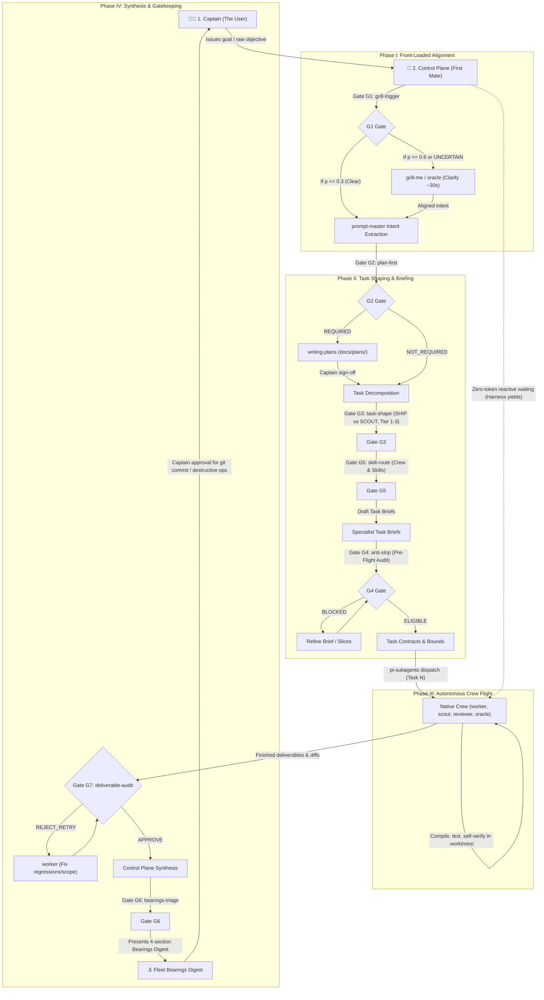

# Agentic Conventions & Control Plane Network (ACON)

> **Firstmate Architectural Standard:** *"Talk to one agent. Ship with a crew."*

**ACON** is an autonomous multi-agent orchestration distro and skill network. It transforms your primary AI coding assistant into an **Agent Control Plane** (the *First Mate*), delegating complex implementation, audits, and spikes to specialized subagents (*Crewmates*) while serving you, the **Captain**.

No external bash daemons or runtime terminal multiplexers required—ACON operates natively within AI agent harnesses using tool-level delegation (`invoke_subagent`, `manage_subagents`, `send_message`).

---

## 🚀 Quick Start

1. **Clone the repo**
   ```bash
   git clone https://github.com/HairyBlue/acon.git
   ```

2. **Open the ACON repo** with your AI coding assistant (AGY, Claude Code, Cursor, etc.)

3. **Tell your agent** where your project is:
   > "Adopt ACON into my project at ~/my-project"

4. **Your agent handles the rest** — it reads the adoption protocol, detects your project's framework, copies the constitution and skills, and scaffolds a local Workshop Manual tailored to your stack.

### Requirements

- An AI coding assistant (AGY, Claude Code, Cursor, or any tool that reads `AGENTS.md` / `CLAUDE.md`)
- Standard Unix utilities (`bash`, `rsync`) for `./scripts/adopt.sh`

---

## 🏛️ Core Architecture: Bridge vs. Workshop

ACON resolves the tension between project-level rules and multi-agent coordination by separating concerns into two distinct layers:

```
┌─────────────────────────────────────────────────────────────────────────┐
│                        THE COMMAND BRIDGE                               │
│                         (ACON / AGENTS.md)                              │
│  • One Captain, One Liaison                                             │
│  • Zero-Execution & Zero-Archaeology Mandate (Single-Turn Dispatch)     │
│  • Task Shaping: SHIP (code/tests) vs. SCOUT (read-only spikes)         │
│  • Mutually Exclusive File Scopes (Zero Write Collisions)               │
│  • Zero-Token Reactive Waiting (No Busy-Polling Loops)                  │
│  • On-Demand Fleet Bearings Status Reporting                            │
└────────────────────────────────────┬────────────────────────────────────┘
                                     │
                    [Dispatches Specialist Subagents]
                                     │
                                     ▼
┌─────────────────────────────────────────────────────────────────────────┐
│                        THE WORKSHOP MANUAL                              │
│              (Target Repo AGENTS.md / CLAUDE.md)                        │
│  • Local build, test, and lint commands                                 │
│  • Framework architecture and directory conventions                     │
│  • Team coding styles and language standards                            │
└─────────────────────────────────────────────────────────────────────────┘
```

1. **The Command Bridge (`AGENTS.md`)**: Governs *who commands, how work is partitioned, boundary safety, and status reporting*.
2. **The Workshop Manual (Target Repo `AGENTS.md` / `CLAUDE.md`)**: Governs *local codebase rules*. Dispatched specialists automatically inspect and follow the target repo's local manual without polluting it.

---

## 🔄 The End-to-End Fleet Operating Workflow

The Control Plane orchestrates all multi-agent missions through an airtight 4-phase lifecycle governed by Machine-Native Decision Gates:



1. **Phase I: Front-Loaded Alignment (Captain $\rightarrow$ Control Plane):** Intent extraction via [`prompt-master`](.agents/skills/productivity/prompt-master/SKILL.md) and **Gate G1 (`grill-trigger`)**, triggering 1–3 upfront clarifying questions via [`grill-me`](.agents/skills/productivity/grill-me/SKILL.md) or second-opinion analysis via `oracle` to lock architecture.
2. **Phase II: Task Shaping & Calibrated Briefing (Control Plane):** Task decomposition governed by **Gate G2 (`plan-first`)**, strict `SHIP` vs. `SCOUT` classification via **Gate G3 (`task-shape`)**, specialist crew routing via **Gate G5 (`skill-route`)**, non-overlapping file boundaries, and pre-flight validation via **Gate G4 (`anti-slop`)**.
3. **Phase III: Autonomous Crew Flight (Control Plane $\rightarrow$ Crew):** Specialist dispatch via native `pi-subagents` (`worker`, `scout`, `reviewer`, `oracle`, `evidence-auditor`), isolated `.worktrees/<branch>` execution, zero-token reactive waiting (harness yields), and closed-loop self-verification (tests for business logic; lint/build for test-exempt tasks).
4. **Phase IV: Central Synthesis & Gatekeeping (Control Plane $\rightarrow$ Captain):** Post-flight universal verification via **Gate G7 (`deliverable-audit`)** (verifying tests pass, no scope creep, and simplicity), central file integration, status event triage via **Gate G6 (`bearings-triage`)**, the 4-section Fleet Bearings digest, and explicit Captain approval for git commits and destructive operations.

### 🛡️ Machine-Native Decision Gates (The Jev Protocol)

To eliminate conversational guesswork, sycophancy, and uncalibrated LLM confidence across autonomous missions, ACON embeds **Machine-Native Decision Gates** ([`decision-gates`](.agents/skills/productivity/decision-gates/SKILL.md)).

Borrowing the core concept from TypeSafe (Jev)—*state in, typed answers with coarse probabilities out, deterministic lookup table outcome*—the protocol operates with **zero code, external APIs, or runtime dependencies**:

* **G1 (`grill-trigger`)**: Gates Phase I upfront alignment, triggering `grill-me` or `oracle` on ambiguous intent.
* **G2 (`plan-first`)**: Gates Phase II planning, deterministically mandating implementation plans for architectural or schema changes.
* **G3 (`task-shape`)**: Governs `SHIP` vs. `SCOUT` task classification and Pre-Dispatch Tiers (1–3).
* **G4 (`anti-slop`)**: Enforces pre-flight task brief eligibility, strict 3-file bounds, and automated test specifications.
* **G5 (`skill-route`)**: Routes appropriate specialist roles and modular domain skills from `.agents/INDEX.md`.
* **G6 (`bearings-triage`)**: Filters status updates and escalates critical blockers to the Captain's Call.
* **G7 (`deliverable-audit`)**: Universal post-flight verification auditing worker diffs for regressions, scope creep, and simplicity before central synthesis.

Every gate ships in `Mode: advisory`, operates strictly **tighten-only**, and anchors probabilistic claims in verbatim code citations. Detailed documentation and worked cases are available in [`.agents/skills/productivity/decision-gates/SKILL.md`](.agents/skills/productivity/decision-gates/SKILL.md).

---

## 🚀 How to Utilize the Control Plane

### Pattern 1: Central Command Hub (Firstmate Style — Recommended)
Run your primary agent directly inside the **ACON** workspace. You can direct it to work on any local repository without adding extra files to that repository:

```text
Captain: "Inspect /path/to/billing-app. Decompose the Stripe webhook refactor
          into backend service and feature tests, and dispatch specialists."
```

* The Control Plane activates the Foreign Boundary Trigger and immediately dispatches a `Codebase Scout` subagent in turn 1 to inspect `/path/to/billing-app`.
* Based on the scout's findings, it shapes tasks and spawns a `Backend Specialist` and a `Test Engineer` targeting only the specific billing directories.
* The specialists read `/path/to/billing-app/CLAUDE.md` to follow the project's local coding conventions and test runners.
* The Control Plane synthesizes results, verifies integration, and briefs you.

---

### Integrating ACON into Existing Projects
To adopt ACON into an existing project while preserving all local conventions verbatim, run the adoption script:
```bash
./scripts/adopt.sh /path/to/my-project
```
Alternatively, invoke our built-in [`adopt-acon`](.agents/skills/productivity/adopt-acon/SKILL.md) skill to inspect, onboard, and configure any existing repository automatically.

---

## ⚓ Fleet Status Protocol (The Bearings Digest)

Whenever you ask:
> *"What is the status?"*, *"Give me bearings"*, *"Where are we at?"*, or *"Recap"*

The Control Plane renders the canonical **4-section Bearings digest**:

```markdown
### ⚓ Fleet Bearings Digest

#### 1. Captain's Call
*ONLY unsuppressed items needing the Captain's action now: decisions, blockers, PR approvals.*
- **[Decision #1]**: Choose between Redis vs. Database cache locks for Stripe webhook idempotency.
  - *Option A (Recommended):* Redis Cache Locks (`Cache::lock`) — atomic and high-throughput.
  - *Option B:* Database transactions — higher latency but zero external dependencies.
*(Empty-state: "Nothing needs your action right now.")*

#### 2. Recently Landed
*Bounded recent completions: verified code, merged PRs, or completed scout reports.*
- **[Stripe Webhook Idempotency]** (`Ship`): Implemented `app/Services/Billing/WebhookHandler.php`, 8 Pest tests passing.
*(Empty-state: "No recent completions are in the current baseline.")*

#### 3. Underway
*Live work progressing on its own: one line of current state per active specialist.*
- **[Test Engineer]** (`Ship`): Authoring concurrency tests in `tests/Feature/Billing/` [In flight]
*(Empty-state: "Nothing is underway.")*

#### 4. Charted Next
*Queued work waiting on active dependencies.*
- **[Frontend UI Notification]**: Blocked on backend webhook payload finalization.
*(Empty-state: "Nothing is queued.")*
```

---

## 📁 Repository Structure

```
acon/
├── AGENTS.md                                     # The Control Plane Constitution (Master Rules)
├── CLAUDE.md                                     # Symlink -> AGENTS.md
├── README.md                                     # Human-facing guide and operational instructions
├── scripts/                                      # Control Plane automation scripts
│   └── adopt.sh                                  # Repository adoption & synchronization script
├── .claude/                                      # Claude Code IDE integration
│   ├── INDEX.md -> ../.agents/INDEX.md
│   ├── README.md -> ../.agents/README.md
│   ├── rules -> ../.agents/rules
│   └── skills/                                   # Domain symlinks -> ../../.agents/skills/*
├── .cursor/                                      # Cursor IDE integration
│   ├── INDEX.md -> ../.agents/INDEX.md
│   ├── README.md -> ../.agents/README.md
│   ├── rules -> ../.agents/rules
│   └── skills/                                   # Domain symlinks -> ../../.agents/skills/*
└── .agents/                                      # Central Physical Source of Truth (Pure Conventions)
    ├── INDEX.md                                  # Fast symptom, task, and skill lookup matrix
    ├── README.md                                 # Internal catalog
    ├── rules/                                    # Non-Negotiable Agent Rules
    │   ├── agent-control-plane.md                # Delegation, Bearings, and task contracts
    │   ├── security-secrets-guard.md             # Zero-leakage policy for credentials and secrets
    │   ├── git-conventional-commits.md           # Conventional Commits v1.0.0
    │   └── progress-reporting.md                 # Markdown-first daily reporting standards
    └── skills/                                   # Curated Modular Agent Skills
        ├── design/                               # 2 Skills + 67 style presets (interface-design, impeccable & 67 style presets)
        ├── engineering/                          # 14 Skills (refactoring, api-design, zero-downtime-migrations, tdd...)
        ├── productivity/                         # 14 Skills (adopt-acon, decision-gates, prompt-master, ponytail, grammars...)
        └── security-devops/                      # 6 Skills (security-audit, git-worktrees, shell-scripting, pre-commit...)
```

---

## 📖 Dynamic Documentation Standard

ACON intentionally ships **zero bundled framework tutorials or static library manuals**. Bundled framework documentation rapidly becomes outdated, adds maintenance overhead, and causes version drift against target codebases.

Instead, ACON enforces the **Dynamic Documentation Standard**:
1. **Manifest Inspection:** When an agent operates on a specific framework or library, it inspects the target project's dependency manifest (`package.json`, `composer.json`, `pyproject.toml`, `Cargo.toml`, `go.mod`) to determine the exact pinned version.
2. **On-Demand Consultation:** The agent consults the framework's official documentation, releases, or repository matching that specific version on demand.
3. **Workshop Manual Alignment:** Local framework conventions, project quirks, or architecture standards are maintained in the target repository's Tier 2 [Workshop Manual](AGENTS.md#3-command-bridge-vs-workshop-manuals-multi-repo-interoperability).

---

## 🛠️ Curated Specialist Skills (`.agents/skills/`)

When the Control Plane dispatches specialists, it equips them with targeted domain skills on demand:

### 🎨 1. Design & UI/UX (`.agents/skills/design/` - 2 Skills + 67 Presets)
- **`interface-design`**: Foundational craft engineering to eradicate generic AI slop. Enforces single focal points, weight > size hierarchy, 60/30/10 color rule, subtle surface elevation, persistent design memory (`system.md`), and anti-slop audits (`design-deslop`).
- **`impeccable`**: Design Director and visual quality floor engine with 23 lifecycle commands, craft floor quality checks, and mechanical anti-pattern detection.
- **`styles/` (67 Aesthetic Style Presets)** with explicit intent-to-style routing:
  - **Clean & Minimal**: [`styles/clean`](.agents/skills/design/styles/clean/DESIGN.md), [`styles/minimal`](.agents/skills/design/styles/minimal/DESIGN.md), [`styles/spacious`](.agents/skills/design/styles/spacious/DESIGN.md) (ample whitespace, 8pt grid, low cognitive load).
  - **Slick & Modern Tech**: [`styles/sleek`](.agents/skills/design/styles/sleek/DESIGN.md), [`styles/bento`](.agents/skills/design/styles/bento/DESIGN.md), [`styles/shadcn`](.agents/skills/design/styles/shadcn/DESIGN.md), [`styles/modern`](.agents/skills/design/styles/modern/DESIGN.md) (Inter + JetBrains Mono, dark elevation, subtle borders).
  - **Enterprise & Dense**: [`styles/ant`](.agents/skills/design/styles/ant/DESIGN.md), [`styles/corporate`](.agents/skills/design/styles/corporate/DESIGN.md), [`styles/enterprise`](.agents/skills/design/styles/enterprise/DESIGN.md), [`styles/matrix`](.agents/skills/design/styles/matrix/DESIGN.md) (compact tables, tabular numerals).
  - **Bold & Expressive**: [`styles/neobrutalism`](.agents/skills/design/styles/neobrutalism/DESIGN.md), [`styles/bold`](.agents/skills/design/styles/bold/DESIGN.md), [`styles/neon`](.agents/skills/design/styles/neon/DESIGN.md) (hard shadows, black outlines, saturated contrast).
  - **Warm & Editorial**: [`styles/editorial`](.agents/skills/design/styles/editorial/DESIGN.md), [`styles/claude`](.agents/skills/design/styles/claude/DESIGN.md), [`styles/paper`](.agents/skills/design/styles/paper/DESIGN.md) (serif headlines, parchment warmth, natural earth tones).
  - **Playful & Retro**: [`styles/claymorphism`](.agents/skills/design/styles/claymorphism/DESIGN.md), [`styles/glassmorphism`](.agents/skills/design/styles/glassmorphism/DESIGN.md), [`styles/retro`](.agents/skills/design/styles/retro/DESIGN.md) (3D pill depth, frosted glass, 8-bit nostalgia).

### ⚙️ 2. Engineering (`.agents/skills/engineering/` - 14 Skills)
- **`refactoring`**: Fowler refactoring catalog, green-to-green invariant, Two-Hats rule, guard clauses, extract method, polymorphism, and strangler fig.
- **`api-design`**: RESTful modeling, RFC 7807 problem details, idempotency keys, keyset/cursor pagination, and HMAC webhooks.
- **`zero-downtime-migrations`**: 5-phase Expand/Contract pattern, online index creation, lock timeouts, and batched non-locking backfills.
- **`tdd`**: Strict red-green-refactor test-driven development loop.
- **`code-review`**: Parallel two-axis review (Standards adherence + Spec conformance).
- **`diagnosing-bugs`**: Systematic red-test feedback loop and regression verification.
- **`domain-modeling`**: Ubiquitous language definition, scenario testing, and ADR tracking.
- **`codebase-design`** & **`improve-codebase-architecture`**: Deep module design principles (small interfaces, clean seams).
- **`to-spec`** & **`to-tickets`**: Conversation-to-spec synthesis and tracer-bullet ticket breakdown.

### 🧠 3. Productivity (`.agents/skills/productivity/` - 14 Skills)
- **`adopt-acon`**: Universal repository adoption and synchronization suite. Enforces physical catalog deployment, CLAUDE.md symlink to AGENTS.md, Two-Tier AGENTS.md merge standard (preserving existing project guidelines verbatim), and fail-closed verification.
- **`decision-gates`**: Structured Jev probability sheets, 7 typed decision gates (G1–G7), anti-slop audits, deliverable verification, and empirical calibration logging.
- **`grammars-and-constrained-sampling`**: Formal machine contracts (YAML/JSON schemas, closed enums, Token-0 anchoring) to eliminate preamble fluff and formatting drift.
- **`io-verification-control`**: Master 4-stage lifecycle governing input context slicing, dynamic sampling calibration, Token-0 machine contracts, and deterministic tool verification.
- **`ponytail`**: Pragmatically lazy senior engineer persona, 7-Rung Decision Ladder (YAGNI, stdlib, platform natives, zero-deps, inline clarity), anti-overengineering reviews, and debt ledger.
- **`prompt-master`**: 9-dimension intent extraction, model-specific prompt calibration, and airtight agent task briefs.
- **`grill-me`**: Relentless design & plan interrogation: core design tree interview engine in rounds along the decision frontier.
- **`handoff`**: Compacts conversation context into a structured handoff document.
- **`writing-plans`**: Bite-sized TDD implementation planning, interface contracts (Consumes/Produces), and zero-placeholder specs before touching code.
- **`developer-story`**: Authentic developer stories, builder journeys, personal dispatches, and CASI portfolio case studies.
- **`to-questionnaire`**: Formats complex design decisions into fillable Markdown questionnaires.
- **`writing-for-agents`**: Guidelines and mechanics for authoring effective skills and agent rules.
- **`technical-writing-for-engineers`**: Technical RFCs, architecture decisions, and post-mortems.
- **`daily-progress-report`**: Work summary and Notion publishing via MCP.

### 🔒 4. Security & DevOps (`.agents/skills/security-devops/` - 6 Skills)
- **`security-audit`**: Universal, language-agnostic static security audit engine (OWASP Top 10 (2021), OWASP API Security Top 10 (2023), D1-D10 matrix, taint analysis, AST triage, closed-loop remediation).
- **`shell-scripting`**: Production bash scripting, `set -euo pipefail`, cleanup traps, safe quoting, and option parsing.
- **`git-worktrees`**: Multi-agent git worktree isolation topology, lifecycle management, and branch collision avoidance.
- **`conventional-commits`**: Conventional Commits v1.0.0 specification enforcement.
- **`git-guardrails`**: Universal pre-execution hooks blocking destructive git operations.
- **`setup-pre-commit`**: Husky + lint-staged + Prettier / typecheck pre-commit hooks.

---

## 🔍 Central Lookup Matrix

Refer to **[`.agents/INDEX.md`](.agents/INDEX.md)** for a fast symptom, task, and skill lookup matrix.

---

## 📚 References & Prior Art

ACON builds upon and draws architectural inspiration from pioneering patterns in the AI agent and developer tooling ecosystem:

- **[Firstmate](https://github.com/kunchenguid/firstmate)**: Architectural standard for the Agent Control Plane (*"Talk to one agent. Ship with a crew."*), First Mate liaison model, Ship vs. Scout task shaping, non-overlapping file boundary isolation, and Fleet Bearings status digests.
- **[nidhinjs / prompt-master](https://github.com/nidhinjs/prompt-master)**: 9-dimension intent extraction, model-specific prompt calibration, and airtight agent task briefing templates.
- **[Dammyjay93 / interface-design](https://github.com/Dammyjay93/interface-design)**: Craft-first interface design engineering, anti-slop rules, subtle surface elevation, and persistent design memory.
- **[bergside / awesome-design-skills](https://github.com/bergside/awesome-design-skills)**: Curated registry of 67 design system skill presets and token specifications.
- **[Matt Pocock's Skills](https://github.com/mattpocock/skills)**: Modular agent skill conventions, disciplined engineering workflows, specification synthesis, and reproducible agent interactions.
- **[Cal.diy Repository](https://github.com/calcom/cal.diy/tree/main)**: Structural pattern for `.claude`, `.cursor`, and `.agents` symlinks, centralized rules, and cross-IDE agent tooling configuration.
- **[3stoneBrother / code-audit](https://github.com/3stoneBrother/code-audit)**: Static code security analysis methodology, vulnerability checklists (PHP, JS, Python, C#), taint tracking, and verification techniques.
- **[marcelorodrigo / agent-skills](https://github.com/marcelorodrigo/agent-skills)**: Curated agent skills ecosystem, engineering workflows, and prompt architecture.
- **[dietrichgebert / ponytail](https://github.com/dietrichgebert/ponytail)**: Pragmatically lazy senior developer persona, 7-Rung Decision Ladder (YAGNI, stdlib, platform natives, zero-deps, inline clarity), and code-level anti-overengineering reviews.

> **Heartfelt Acknowledgement:** Immense gratitude to the countless open-source developers, researchers, and community builders whose gists, discussions, and experiments have quietly advanced modern agentic conventions and developer tooling. Even where not cited individually by name, your work and shared knowledge form the collective bedrock of this project. Thank you!

