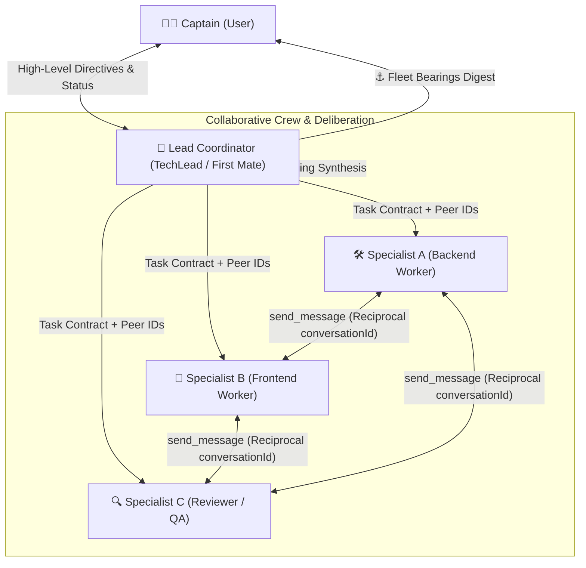
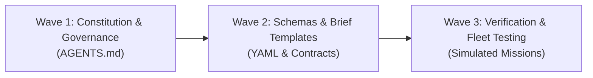

# Ratified Architecture Plan: Dynamic Reasoning Effort Scaling, Provider-Agnostic Model Inheritance & Collaborative Crew Lead Architecture

- **Status:** APPROVED by Captain (Ratified)
- **Date:** 2026-09-24
- **Scope:** Dynamic Model Inheritance (`Model: inherit`), Universal Reasoning Effort Scaling (`effort: none | low | medium | high | max`), Cross-Provider Parameter Translation Matrix & Invariants, Collaborative Multi-Agent Crew & Lead Architecture, Reciprocal Peer-to-Peer Inter-Agent Messaging, and 3-Round Deliberation Protocol.
- **Origin:** Ratified architecture directive to decouple the ACON fleet from hardcoded vendor model strings, establish mathematical reasoning effort budgets across AI providers, and unlock high-bandwidth peer collaboration among subagents while enforcing strict token discipline.

---

## 1. Hard Invariants

1. **Zero-Code Protocol Invariant:** Every artifact, specification, contract, and workflow authored under this architecture is strictly pure markdown (`.md`) or schema-locked YAML (`.yaml`). No Python, Node.js, shell wrapper daemons, AI gateway proxy services, or external runtime libraries may be introduced.
2. **Universal Model Inheritance Invariant (`Model: inherit`):** All subagent dispatches (`invoke_subagent`) MUST specify `Model: inherit` by default. Hardcoded vendor strings (such as `gpt-5`, `claude-3-7-sonnet`, `gemini-2.5-pro`, or `o3-mini`) in agent dispatch manifests or task briefs are strictly prohibited. The fleet dynamically inherits the active runtime model selected by the Captain or host harness.
3. **Provider-Agnostic Effort Abstraction:** Subagent task briefs and contracts parameterize cognitive depth exclusively through the universal abstraction enum: `effort: none | low | medium | high | max`. No subagent contract may include raw provider parameters (such as `budget_tokens` or `reasoning_effort`). Translation to provider-specific payloads is handled deterministically at the harness or adapter interface.
4. **Lead Authority & Non-Overlapping Peer Scoping:** Lead Coordinators (`TechLead`, `LeadScout`, or First Mate) hold sole authority over mission decomposition, file boundary assignments, and binding conflict resolution. Peer-to-peer inter-agent communication is permitted exclusively within non-overlapping file boundaries; no peer may edit another peer's assigned files or override the Lead's architectural rulings.
5. **Single-Turn Dispatch Invariant:** The Control Plane Bridge and Lead Coordinators NEVER perform exploratory tool loops or file archaeology directly on their primary command thread. When investigation, schema discovery, or spikes are required, a specialized subagent is dispatched in the very first turn.
6. **Strict Token & Preamble Discipline:** All inter-agent exchanges and deliberative outputs MUST maintain Token-0 anchoring, schema-locked envelopes, discrete enums, and a zero-preamble policy. Conversational chatter between agents is prohibited.

---

## 2. Dynamic Reasoning Effort Architecture

Modern frontier model families feature test-time compute scaling (extended thinking / reasoning tokens), but each vendor exposes divergent APIs, parameter names, and operational constraints. ACON abstracts reasoning effort into a normalized 5-level scale, mapped deterministically to task complexity tiers.

### 2.1 Universal Effort Tiers & Task Tier Mapping

```
                                 ┌────────────────────────────────────────────────────────┐
                                 │             Universal Effort Abstraction               │
                                 │        none  |  low  |  medium  |  high  |  max        │
                                 └───────────────────────────┬────────────────────────────┘
                                                             │
                    ┌────────────────────────────────────────┼────────────────────────────────────────┐
                    ▼                                        ▼                                        ▼
      ┌───────────────────────────┐            ┌───────────────────────────┐            ┌───────────────────────────┐
      │          Tier 3           │            │          Tier 2           │            │          Tier 1           │
      │    Lightweight Lookup     │            │      Standard Brief       │            │     Full Calibration      │
      ├───────────────────────────┤            ├───────────────────────────┤            ├───────────────────────────┤
      │ • Quick read-only scout   │            │ • Single-agent Ship tasks │            │ • Multi-agent missions    │
      │ • Mechanical refactors    │            │ • Plan-exempt multi-file  │            │ • Core architecture       │
      │ • Closed enum lookups     │            │ • Component refactoring   │            │ • Dual-blind evaluations  │
      ├───────────────────────────┤            ├───────────────────────────┤            ├───────────────────────────┤
      │ Effort: low / none        │            │ Effort: medium            │            │ Effort: high / max        │
      └───────────────────────────┘            └───────────────────────────┘            └───────────────────────────┘
```

1. **`effort: none`:** Extended thinking disabled. Standard deterministic generation. Used for mechanical text substitutions, simple schema validation, formatting passes, and automated diff echoes.
2. **`effort: low`:** Minimal reasoning compute (~1,024 thinking tokens). Used for Tier 3 lightweight scout lookups, single-symbol renames, docstring generation, and simple triage checks.
3. **`effort: medium` (Standard Default):** Balanced reasoning compute (~4,096 thinking tokens). Used for Tier 2 standard implementation briefs (`SHIP`), unit test generation, isolated bug fixes, and standard code reviews.
4. **`effort: high`:** Deep reasoning compute (~16,384 thinking tokens). Used for Tier 1 multi-agent missions, complex algorithmic logic, security audits, database schema migrations, and high-ambiguity decision sheets.
5. **`effort: max`:** Maximum provider compute budget (up to context window limit, e.g., 32k–64k tokens). Used for high-stakes architectural disputes, critical consensus arbitration, and system-level security penetration analysis.

---

### 2.2 Comprehensive Cross-Provider Translation Matrix

When executing under or targeting specific LLM harness providers, the universal `effort` tiers are mapped according to the following canonical specification:

| Provider / Model Family | API Parameter Name | `none` | `low` | `medium` | `high` | `max` | Critical Provider Invariants & Constraints |
| :--- | :--- | :--- | :--- | :--- | :--- | :--- | :--- | :--- |
| **OpenAI**<br>`o1`, `o3`, `o3-mini`, `gpt-5` | `reasoning_effort` | *(omitted / unsupported on pure reasoning models)* | `"low"` | `"medium"` | `"high"` | `"high"` *(or max supported)* | **1.** `max_completion_tokens` MUST be used instead of deprecated `max_tokens`.<br>**2.** `temperature` is unsupported or must be `1.0`.<br>**3.** Developer messages replace system messages for steering. |
| **Anthropic**<br>`claude-3-7-sonnet` | `thinking: { type: "enabled", budget_tokens: N }` | `thinking: { type: "disabled" }` | `budget_tokens: 1024` | `budget_tokens: 4096` | `budget_tokens: 16384` | `budget_tokens: 32768` *(or up to 64000)* | **1. Invariant 1 (`max_tokens > budget_tokens`):** `max_tokens` MUST strictly exceed `budget_tokens`. Failing this triggers an immediate `400 invalid_request_error`.<br>**2. Invariant 2 (`temperature: 1.0`):** When thinking is enabled, `temperature` MUST be set to `1.0` (any other value is rejected).<br>**3. Invariant 3 (Thinking Block Echoing):** Thinking blocks returned in assistant responses must be echoed back unaltered in multi-turn conversation histories. |
| **Google Gemini**<br>`gemini-2.5-pro`, `gemini-2.5-flash` | `thinking_config: { thinking_budget: N }` | `thinking_budget: 0` | `thinking_budget: 1024` | `thinking_budget: 4096` | `thinking_budget: 16384` | `thinking_budget: 32768` | `thinking_budget: 0` explicitly disables thinking in Gemini 2.5 series. When budgeting, ensure output token limits accommodate both thinking and payload tokens. |
| **Google Gemini**<br>`gemini-3.x-preview` | `thinking_config: { thinking_level: LEVEL }` | `"off"` | `"low"` | `"medium"` | `"high"` | `"high"` *(with extended token budget)* | Supports discrete `thinking_level` strings directly matching universal effort abstractions. |
| **DeepSeek**<br>`deepseek-reasoner` (R1) | Model Endpoint Selection / `reasoning_content` | Routed to `deepseek-chat` (V3) | `deepseek-reasoner` (Standard) | `deepseek-reasoner` (Standard) | `deepseek-reasoner` (Extended) | `deepseek-reasoner` (Max output) | Thinking tokens are emitted in dedicated `reasoning_content` field. In multi-turn chat, `reasoning_content` must not be injected into the user prompt unless specifically configured for CoT preservation. |
| **xAI**<br>`grok-3-thinking` | `reasoning_effort` / `thinking: { enabled: bool }` | `thinking: { enabled: false }` | `"low"` | `"medium"` | `"high"` | `"high"` | Adheres to OpenAI-compatible endpoint signatures with thinking toggle flags. |

---

### 2.3 Provider Invariant Enforcement Rules

1. **Anthropic Token Budget Guard:** Whenever compiling an Anthropic API call with thinking enabled:
   $$\text{max\_tokens} \ge \text{budget\_tokens} + \text{min\_response\_tokens (default 2048)}$$
   Under no circumstances may `max_tokens` be set equal to or less than `budget_tokens`.
2. **Temperature Lock Invariant:** For all reasoning-enabled calls across OpenAI and Anthropic, temperature is hard-locked to `1.0`. Custom sampling temperatures (`0.0`–`0.2`) are applied only when reasoning is disabled (`effort: none`).
3. **OpenAI Completion Token Migration:** Any agent harness generating OpenAI chat completions must strip `max_tokens` and set `max_completion_tokens` to accommodate the unified sum of hidden reasoning tokens and visible output tokens.

---

## 3. Collaborative Multi-Agent Crew & Lead Architecture ("Working Together Like People")

To solve complex engineering objectives without creating bottlenecked supervisor threads or chaotic free-for-all chat rooms, ACON implements a **Lead Coordinator + Peer-to-Peer Dialogue** architecture. Agents collaborate dynamically, cross-examine proposals, and synthesize solutions with strict token discipline.

### 3.1 Crew Leadership & Specialist Personas



1. **The Lead Coordinator (`TechLead` / `LeadScout` / First Mate):**
   - Serves as the mission architect and arbiter.
   - Decomposes the Captain's directive into orthogonal task contracts.
   - Dispatches workers and immediately transmits reciprocal `conversationId` handles to each participant.
   - Remains in reactive wait mode during peer execution; steps in only to arbitrate deadlocks or render binding synthesis.
2. **Domain Specialist Subagents (`worker`, `scout`, `reviewer`, `oracle`):**
   - Operate autonomously within assigned non-overlapping file scopes.
   - Communicate peer-to-peer using native `send_message` with known reciprocal IDs.
   - Consult one another on shared interfaces (e.g., REST/GraphQL schemas, shared types, API response formats) before writing code.

---

### 3.2 Peer-to-Peer Inter-Agent Dialogue via Reciprocal IDs

In standard architectures, child agents cannot see or talk to each other; all communication must route through the parent, causing context explosion and blocking execution. In ACON's Collaborative Crew model:

1. **Reciprocal ID Injection:** Upon launching specialists, the Lead sends an initialization brief containing the roster of peer IDs:
   ```yaml
   peerConversations:
     backendSpecialist: "conv-subagent-8492-bc10"
     frontendSpecialist: "conv-subagent-8493-af21"
     qaReviewer: "conv-subagent-8494-de32"
   ```
2. **Direct Peer Consultation:** When `backendSpecialist` defines an API route contract, it directly calls `send_message` targeting `conv-subagent-8493-af21` to verify frontend compatibility before implementation.
3. **Strict Non-Overlapping Boundaries:** Direct messaging does NOT grant permission to touch peer files. If `frontendSpecialist` needs a change in the backend model, it requests the change via peer message; it NEVER modifies backend files directly.

---

### 3.3 The 3-Round Deliberation Protocol

When resolving architectural ambiguities, interface designs, or multi-option trade-offs, the crew executes a structured 3-Round Deliberation Protocol:

```
Round 1: Independent Pitches ──> Round 2: Cross-Examination ──> Round 3: Lead Binding Verdict
   (Dual-Blind Sheets)                (1-Round Bounded)               (Irrevocable Synthesis)
```

1. **Round 1: Independent Pitches (Dual-Blind Formulation):**
   - Each participating specialist authors an independent proposal using the schema-locked envelope `.agents/reference/schemas/decision-sheet.yaml`.
   - Specialists formulate their pitch in isolation without viewing peer pitches, preventing anchoring bias and groupthink.
2. **Round 2: Bounded Cross-Examination (1 Turn Each):**
   - The Lead shares Pitch A with Specialist B, and Pitch B with Specialist A.
   - Each specialist has exactly **one turn** to challenge assumptions, highlight edge cases, or propose compromises via `send_message`.
   - Maximum token budget: $\le 500$ tokens per cross-examination brief. No conversational chit-chat allowed.
3. **Round 3: Lead Binding Verdict & Synthesis:**
   - The Lead evaluates both pitches and critiques.
   - The Lead emits a deterministic outcome block:
     ```text
     DELIBERATION VERDICT
     topic: <architectural-topic> | rounds: 3 | lead: TechLead
     selected_approach: <Approach-A | Approach-B | Hybrid>
     binding_contracts:
       - producer: Specialist A | consumes: [] | produces: api/types/v1.json
       - producer: Specialist B | consumes: api/types/v1.json | produces: ui/components/table.vue
     arbitration_summary: <Single-paragraph rationale with verbatim citations>
     ```
   - All specialists proceed to execute under the binding contracts.

---

### 3.4 Anti-Chat & Token Discipline Governance

Multi-agent messaging carries severe risks of infinite conversational loops ("Thank you!", "You're welcome!", "Any thoughts?"). ACON enforces machine-level governance:

1. **Token-0 Anchoring & Zero Preamble:** Every inter-agent message MUST begin immediately with structural markup or YAML (`---`, `{`, or `#`). Conversational greetings, politeness markers, and conversational padding are grounds for message rejection.
2. **Bounded Conversation Limits:** A maximum of 1 round of reciprocal cross-examination is permitted per decision topic. Endless back-and-forth threads are rejected by the Lead.
3. **Verbatim Evidence Citations:** Critiques must cite verbatim code or requirements ($\le 120$ characters). Speculative or subjective criticism is discarded.
4. **Structured Payloads:** Inter-agent communication must use standardized markdown sections:
   - `### PROPOSED_CONTRACT`
   - `### CRITIQUE_EVIDENCE`
   - `### RESOLUTION_REQUEST`

---

## 4. Execution Waves: Roadmap to Implementation



### Wave 1: Constitution & Governance Updates (`AGENTS.md`)
- [ ] **Task 1.1:** Update `AGENTS.md` §4 Rule 1 to codify the `Model: inherit` standard and universal reasoning effort scaling (`none | low | medium | high | max`).
- [ ] **Task 1.2:** Add `AGENTS.md` §4 Rule 12: "Collaborative Crew & Lead Architecture (Peer-to-Peer Dialogue, Reciprocal IDs, and 3-Round Deliberation)".
- [ ] **Task 1.3:** Update §4 Rule 7 (Tiered Pre-Dispatch Protocol) to map Tier 1 $\rightarrow$ `effort: high`, Tier 2 $\rightarrow$ `effort: medium`, Tier 3 $\rightarrow$ `effort: low`.

### Wave 2: Standardize Brief Templates & Schemas
- [ ] **Task 2.1:** Update `.agents/reference/schemas/task-contract.yaml` to include mandatory `effort` enum field and optional `peerConversations` map.
- [ ] **Task 2.2:** Update `.agents/reference/schemas/decision-sheet.yaml` to capture deliberation metadata (round, peer critiques, binding verdict).
- [ ] **Task 2.3:** Update task brief templates (Template H and Template M) in documentation and skills with effort parameters and peer communication protocols.

### Wave 3: Fleet Testing & Verification
- [ ] **Task 3.1:** Execute simulated peer deliberation mission: dispatch two workers with reciprocal conversation IDs to negotiate an API interface.
- [ ] **Task 3.2:** Verify that Anthropic invariant `max_tokens > budget_tokens` and `temperature: 1.0` are strictly preserved across all test dispatches.
- [ ] **Task 3.3:** Validate zero-token reactive waiting and verify that no infinite message loops occur between peer specialists.

---

## 5. Definition of Done

This architecture plan is formally satisfied when:
1. **Dynamic Model Inheritance:** `Model: inherit` is established as the sole permitted model configuration in dispatch contracts; hardcoded vendor model strings are eliminated.
2. **Provider-Agnostic Abstraction:** The 5-level effort enum (`none`, `low`, `medium`, `high`, `max`) is fully documented and mapped to Task Tiers 1–3.
3. **Cross-Provider Matrix:** Translation mappings and critical API invariants for OpenAI, Anthropic, Gemini, DeepSeek, and xAI are fully ratified.
4. **Collaborative Crew Protocol:** Lead Coordinator role, reciprocal `conversationId` sharing, 3-round deliberation protocol, and anti-chat token discipline are exhaustively specified.
5. **Zero-Code Compliance:** 100% pure markdown and YAML; zero external runtime code, dependencies, or network-bound microservices.
6. **Execution Roadmap:** Actionable, phased execution waves are charted with clear work breakdowns for subsequent implementation.
