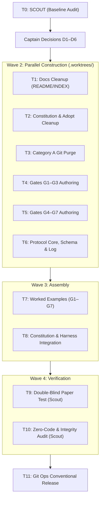

Plan: Decision Gates for ACON (The Jev Concept, No Code) + Crew Engine (pi-subagents) + Bridge Junk Cleanup
Date: 2026-09-20
Status: DRAFT, awaiting Captain sign-off
Scope: Full decision layer (7 gates) as a pure markdown protocol, native `pi-subagents` crew integration (`scout`, `worker`, `reviewer`, `oracle`, `evidence-auditor`), and complete removal of legacy cross-harness bridge relics.
Origin: Formulated to establish Machine-Native Intelligence and strict decision governance across the ACON fleet without introducing external code, APIs, or dependencies.

Hand-off prompt (paste to the primary agent)
> Read this plan completely. Act as the ACON Control Plane: do not execute work yourself, dispatch specialists per §5. Start with T0 (Scout). Then show me decisions D1 to D6 with their defaults and wait for my reply ("defaults ok" is a valid reply) before dispatching any Ship task. Never commit, push, merge, or delete files beyond what §1 rule 0 authorizes without my explicit approval. This plan adds no code of any kind.

---

## 1. Hard Rules & Invariants

0. **The Old Bridge and Job Leftovers Must Go:** Never recreate the old Cross-Harness Bridge (`acon.yaml`, `dispatch.sh`, `.agents/adapters/`, worker pools, model routing artifacts). All files serving only that bridge ("Category A") are authorized for git removal. Stray or unreferenced files ("Category B") require explicit Captain approval (D4).
1. **Keep the "Command Bridge" Metaphor:** "Command Bridge vs. Workshop Manual" in `AGENTS.md` is ACON's core conceptual model. Only the deprecated multi-harness adapter layer is being removed.
2. **Zero Code Invariant (No Jev Product / API):** Only the theoretical concept of Jev (TypeSafe) is borrowed. Every new file is strictly markdown or YAML schema. Do not add Python, Node, shell scripts, SDKs, AI Gateway endpoints, API keys, or network calls. Nothing in this plan is executed as external software.
3. **Tighten-Only:** Gate outcomes may only add rigor (demanding an implementation plan, higher dispatch tier, scout exploration, second-opinion oracle review, or Captain escalation). A gate outcome must NEVER relax or drop a requirement imposed by the constitution, compiler/test suite, or the Captain.
4. **Advisory by Default:** Every gate ships with `Mode: advisory`. Only the Captain can promote a gate to `Mode: enforce` based on empirical calibration data.
5. **Count, Don't Estimate:** Mechanical checks (file counts, required schema keys, verbatim string matches) are evaluated literally. If an evaluator cannot verify with certainty, the result is `UNCERTAIN`.
6. **Captain-Only Authority Unchanged:** Git commits, pushes, merges, branch deletions, destructive terminal commands (`git reset --hard`, `DROP TABLE`, `rm -rf`), new dependency installations, secrets/credentials, and `[HUMAN-CORE]` business logic remain exclusively under Captain authority.
7. **Do Not Edit `CLAUDE.md` Directly:** It is a symlink to `AGENTS.md`. Edit `AGENTS.md` only.
8. **Constitution Constraints:** Max 3 files per task boundary, non-overlapping file scopes, concurrent workers isolated in `.worktrees/<branch>`, Conventional Commits v1.0.0.

---

## 2. The Core Concepts We Are Applying

### 2.1 The Jev (TypeSafe) Concept: Machine-Native Decision Intelligence
TypeSafe's insight is that large-scale AI automation requires moving away from chat/prose deliberation toward machine-native decision contracts:
- **Typed Answers, No Prose:** Evaluators output strictly structured JSON Decision Sheets (`boolean` probabilities, closed `choice` sets, or ordered `score` levels) with zero conversational preamble.
- **Orthogonal Questions over Shared State:** A gate presents a fixed sequence of independent questions answered against the exact same input state. No answer may cite another answer.
- **Deterministic Lookup Tables:** Gate files define ordered Outcome Rules (first-match-wins) using threshold comparisons in tenths (`0.0` to `1.0`). Evaluators look up the answer mechanically without improvising.
- **Universal Verification (Pre-Flight & Post-Flight):** Input verification (prompt ambiguity, plan-first triggers, anti-slop) and output verification (worker deliverable review, hallucination detection, scope creep checks).
- **Automate the Clear, Review the Uncertain:** High-probability paths proceed autonomously; uncertain cases route to the Captain (`CAPTAINS_CALL`), `grill-me`, or an advisory `oracle`.
- **Compensating for Standard LLMs:** Because we operate without custom RLCD post-trained model weights, we compensate with:
  1. Coarse discrete tenths (`0.1, 0.2 ... 1.0`).
  2. Mandatory verbatim evidence quotes ($\le 120$ characters) checked against the input text.
  3. Strict 7-point self-lint checklist.
  4. Redundant dual-blind Scout sheets for high-stakes tasks.
  5. Continuous calibration logging in `.agents/skills/productivity/decision-gates/log.md`.

### 2.2 The Crew Engine (`pi-subagents` Integration)
ACON's architectural motto is *"Talk to one agent. Ship with a crew."* The fleet leverages Pi's native `pi-subagents` harness:

```
                          ┌──────────────────────────┐
                          │   Captain (The User)     │
                          └─────────────┬────────────┘
                                        │ (Goal / Directive)
                                        ▼
                          ┌──────────────────────────┐
                          │   Control Plane Bridge   │
                          │      (The First Mate)    │
                          └──────┬────────────┬──────┘
             Gate G1/G2 Intake   │            │  Gate G3/G5 Routing
                                 ▼            ▼
                     ┌───────────────┐    ┌─────────────────┐
                     │  oracle      │    │  scout         │
                     │ (Assumptions /│    │ (Codebase Recon │
                     │  2nd Opinion) │    │  & Dual Sheets) │
                     └───────────────┘    └─────────────────┘
                                                  │
                                  Gate G4 Anti-Slop
                                                  ▼
                                          ┌─────────────────┐
                                          │ ️ worker(s)     │
                                          │ (Implementation │
                                          │  in .worktrees/)│
                                          └───────┬─────────┘
                                                  │ (Diffs & Outputs)
                                  Gate G7 Verify  ▼
                                          ┌─────────────────┐
                                          │  reviewer      │
                                          │ (Simplicity,    │
                                          │  Tests & Drift) │
                                          └───────┬─────────┘
                                                  │
                                  Gate G6 Triage  ▼
                          ┌──────────────────────────┐
                          │ Central Synthesis &      │
                          │ ⚓ Fleet Bearings Digest   │
                          └──────────────────────────┘
```

#### The Native Crew Roster:
- **`scout`**: Read-only codebase archaeology, schema discovery, dependency inspection, and independent evaluator for dual-blind Decision Sheets.
- **`worker`**: Autonomous implementation specialist. Modifies files, compiles, runs tests, and produces AST changes within strict file boundaries.
- **`reviewer`**: Post-flight auditor. Inspects worker diffs for regressions, Ponytail anti-overengineering violations, edge cases, and test completeness.
- **`oracle`**: Evaluator and devil's advocate. Challenges assumptions, evaluates high-ambiguity trade-offs, and provides second opinions when gates return `UNCERTAIN`.
- **`evidence-auditor`**: Fact-checker. Validates that verbatim citations and evidence in Decision Sheets actually exist in the target files.
- **`council-mode`**: Bounded supervisor-mediated panel of advisors summoned for major architectural pivots or `[HUMAN-CORE]` escalations.

---

## 3. Design & Architecture

### 3.1 Repository Layout
```
.agents/
├── schemas/
│   └── decision-sheet.yaml           # Schema-locked envelope for all decision sheets
├── skills/
│   └── productivity/
│       └── decision-gates/
│           ├── SKILL.md              # Core protocol, recipes, redundancy, calibration
│           ├── sheet-template.md     # Blank sheet, filled example, self-lint checklist
│           ├── examples.md           # 28+ worked cases (4 per gate)
│           ├── log.md                # Empirical decision & override log
│           └── gates/
│               ├── G1-grill-trigger.md       # Phase I upfront alignment gate
│               ├── G2-plan-first.md          # §4 Rule 10 plan requirement gate
│               ├── G3-task-shape.md          # Task classification & dispatch tier gate
│               ├── G4-anti-slop.md           # Pre-flight brief audit gate
│               ├── G5-skill-route.md         # Specialist & modular skill selection gate
│               ├── G6-bearings-triage.md     # Status & blocker triage gate
│               └── G7-deliverable-audit.md   # Post-flight worker diff verification gate
```

### 3.2 Formal Decision Sheet Schema (`.agents/reference/schemas/decision-sheet.yaml`)
Decision sheets output pure JSON, Token-0 anchored, adhering to:
```json
{
  "gate": "plan-first",
  "evaluator": "scout",
  "stateRef": "Phase II task decomposition for webhook ingest",
  "answers": {
    "schemaChange": { "p": 0.9, "evidence": "adds a new orders table" },
    "highAmbiguityTradeoffs": { "p": 0.1, "evidence": "NONE" },
    "shape": { "choice": "SHIP", "p": { "SHIP": 0.8, "SCOUT": 0.2 }, "evidence": "implement the webhook handler" },
    "severity": { "score": 2, "evidence": "customers cannot check out" }
  }
}
```

### 3.3 Sheet Lint Rules (`sheet-template.md`)
1. **Completeness:** Every question declared in the gate file is answered exactly once, in sequence, with no extraneous keys.
2. **Coarse Probabilities:** Every `p` is a multiple of 0.1 between `0.0` and `1.0`.
3. **Normalized Distributions:** For `choice` questions, the probabilities sum to `1.0` ($\pm 0.1$ margin), and `choice` matches the top probability. Ties yield `UNCERTAIN`.
4. **Valid Level Indexes:** For `score` questions, the value is an integer within declared level bounds.
5. **Grounded Evidence:** `evidence` must be a verbatim quote from the input state ($\le 120$ characters). Required for all choices, scores, and booleans with $p \ge 0.3$. `"NONE"` is permitted only for booleans with $p \le 0.2$.
6. **Citation Verification:** Quotes that cannot be found literally in the input state invalidate that answer, preventing relaxing outcomes.
7. **Controlled Enums:** IDs for skills, presets, and agents must exist verbatim in `.agents/INDEX.md` or the native crew roster.

### 3.4 Outcome Rule Recipes
- **ANY-TRIGGER:** Fires if any trigger question meets `p >= requiredAt`. Resolves to `UNCERTAIN` between `uncertainAt` and `requiredAt` unless an exemption meets `exemptAt`.
- **PICK-CHOICE:** Selects the top option if `p >= minTop`; otherwise resolves to `UNCERTAIN` and applies the safe default.
- **CHECKLIST:** Evaluates a series of expected booleans. Fails if unexpected answer $u \ge 0.6$; uncertain if $u \in [0.4..0.5]$; passes if $u \le 0.3$. Any failure results in `BLOCKED`.
- **SCORE-ROUNDUP:** Maps integer scores directly to severity/complexity levels.

### 3.5 The Seven Decision Gates

1. **G1 `grill-trigger` (Phase I Alignment):**
   - *State:* Captain objective + `prompt-master` 9-dimension summary.
   - *Triggers:* `unresolvedFork`, `ambiguousIntent`, `missingCriticalConstraint`.
   - *Rule:* If any trigger $p \ge 0.6 \rightarrow$ `ASK` (`grill-me`); else `SKIP`. Safe default: `ASK`.

2. **G2 `plan-first` (Phase II Architecture Gate):**
   - *State:* Objective + proposed architecture breakdown.
   - *Mechanical Check:* Literal `/plan` or `"write a plan"` forces `REQUIRED`.
   - *Triggers:* `newSystemFromScratch`, `largeRefactorOrMigration`, `schemaChange`, `coreBusinessLogic`, `highAmbiguityTradeoffs`.
   - *Exemptions:* `designOrStylingOnly`, `mechanicalRefactor`, `obviousSinglePath`.
   - *Rule:* If trigger $p \ge 0.6 \rightarrow$ `REQUIRED`; uncertain at $0.4$; exemption at $0.7 \rightarrow$ `NOT_REQUIRED`. Safe default: `REQUIRED`.

3. **G3 `task-shape` (Phase II Dispatch Classification):**
   - *State:* Task specification + intended file boundaries.
   - *Choices:* `shape` (`SHIP`, `SCOUT`), `tier` (`TIER_1`, `TIER_2`, `TIER_3`).
   - *Rule:* Top option $p \ge 0.6$. Safe defaults: `shape = SCOUT`, `tier = TIER_1`.

4. **G4 `anti-slop` (Pre-Flight Worker Gate):**
   - *State:* Drafted task brief (Template H/M) + target file list.
   - *Mechanical Check:* Target files $> 3$, brief $> 1,500$ words, missing required sections, or overlapping file boundaries with active workers forces `BLOCKED`.
   - *Checklist:* `hasAutomatedVerification`, `isBoundedScope`, `touchesHumanCoreDomain` (expect false), `briefHasReproTestFirst` (if bug fix), `briefSpecifiesTests` (if business logic).
   - *Rule:* Passing checklist $\rightarrow$ `ELIGIBLE`; failure $\rightarrow$ `BLOCKED`.

5. **G5 `skill-route` (Crew & Skill Dispatch Gate):**
   - *State:* Calibrated task brief.
   - *Choices:* `agent` (`worker`, `scout`, `reviewer`, `oracle`, `evidence-auditor`), `primarySkill`, `secondarySkill`, `stylePreset`.
   - *Rule:* Top choice $p \ge 0.5$. Always prepends `ponytail` for `worker` tasks and `git-worktrees` for concurrent tasks.

6. **G6 `bearings-triage` (Status & Blocker Gate):**
   - *State:* Raw status event, error, or operational blocker.
   - *Mechanical Check:* Destructive commands or missing secrets force `CAPTAINS_CALL`.
   - *Questions:* `needsCaptainAction`, `blocksOtherWork`, `severity` (0–3).
   - *Rule:* $p \ge 0.5 \rightarrow$ `CAPTAINS_CALL`; otherwise routes to `Recently Landed`, `Underway`, or `Charted Next`.

7. **G7 `deliverable-audit` (Post-Flight Universal Verification Gate):**
   - *State:* Worker git diff + test output + original task contract.
   - *Mechanical Check:* Non-zero test/linter exit code or modified files outside assigned boundary forces `REJECT_RETRY`.
   - *Questions:* `scopeCreep` (expect false, $p \ge 0.4 \rightarrow$ `FAIL`), `unauthorizedDeps` (expect false, $p \ge 0.3 \rightarrow$ `FAIL`), `ponytailViolation` (expect false, $p \ge 0.5 \rightarrow$ `FAIL`), `testsSufficient` (expect true, $p \le 0.6 \rightarrow$ `FAIL`).
   - *Outcome:* `APPROVE` (send to synthesis), `REJECT_RETRY` (dispatch fix subagent), or `ESCALATE_CAPTAIN`.

### 3.6 Calibration Loop (`.agents/skills/productivity/decision-gates/log.md`)
- Format: `Date | Mission | Gate | Rule | Outcome | Status | Mode | Crew Role | Captain Override | Disagreement Type`
- Calibration Audits: When requested, a `scout` reads the log and computes error rates. If `Mode: advisory` achieves $\ge 30$ logged decisions with tightening override rate $\le 15\%$ and false-relaxing rate $\le 5\%$, the Captain may promote the gate to `Mode: enforce`.

---

## 4. Legacy Bridge & Job Junk Cleanup

- **Category A (Pre-Authorized for Deletion via Rule 0):**
  - `dispatch.sh` and `acon.yaml` (if tracked).
  - `.agents/adapters/` (bridge harness adapters: `agy`, `claude`, etc.).
  - Dispatch runtime artifacts: `.dispatch/`, job pids/locks/logs, bridge temp files.
  - References in `README.md`, `.agents/INDEX.md`, `.agents/README.md`, `.gitignore`.
- **Category B (Requires Explicit Captain Approval D4):**
  - Stray files, empty directories, `.DS_Store`, `*.bak`, stale generated artifacts.

---

## 5. Execution Tasks & Phased Waves



### Wave 1: Baseline Audit
- [ ] **T0 SCOUT (Codebase Scout):** Read-only baseline audit. Verify tracking state of `dispatch.sh` and `acon.yaml`. Scan for legacy bridge terms (`acon.yaml`, `dispatch.sh`, `.agents/adapters`, `cross-harness`, `bridge.enabled`, `PyYAML`). Inventory `.agents/adapters/`, `scripts/`, `.agents/reference/schemas/`, and symlinks. Inventory disk skills per category.
  - *Produces:* Baseline audit report.

### Captain Gate: Decisions D1 to D6 Sign-off

### Wave 2: Parallel Construction (Isolated Worktrees)
- [ ] **T1 SHIP (worker):** Clean `README.md`, `.agents/INDEX.md`, `.agents/README.md`. Remove bridge sections and adapter prerequisites. Sync skill counts with disk.
- [ ] **T2 SHIP (worker):** Clean `AGENTS.md` and `.agents/skills/productivity/adopt-acon/SKILL.md`. Remove bridge references. Stop copying adapters in `adopt-acon`. Preserve "Command Bridge" metaphor.
- [ ] **T3 SHIP (worker):** Git remove verified Category A junk files (`dispatch.sh`, `acon.yaml`, `.agents/adapters/`) and scrub `.gitignore`.
- [ ] **T4 SHIP (worker):** Author Gates G1 to G3 under `.agents/skills/productivity/decision-gates/gates/`.
- [ ] **T5 SHIP (worker):** Author Gates G4 to G7 (including `G7-deliverable-audit.md`).
- [ ] **T6 SHIP (worker):** Author `.agents/reference/schemas/decision-sheet.yaml`, `SKILL.md`, `sheet-template.md`, and initialize `.agents/skills/productivity/decision-gates/log.md`.

### Wave 3: Integration & Examples
- [ ] **T7 SHIP (worker):** Author `examples.md` with 28+ worked cases (4 per gate) covering boundary conditions and unverified evidence invalidations.
- [ ] **T8 SHIP (worker):** Integrate Decision Gates protocol and native `pi-subagents` crew standards into `AGENTS.md` and `README.md`.

### Wave 4: Fleet Quality Assurance
- [ ] **T9 SCOUT (scout):** Double-blind paper test. Evaluate example states using only the gate rules and sheet template. Verify zero outcome mismatches against `examples.md`.
- [ ] **T10 SCOUT (scout):** Zero-code and integrity audit. Verify no `.py`, `.sh`, `.js`, or executable files were added (`git diff --name-status` shows only `.md` and `.yaml`). Verify symlinks.

### Wave 5: Release
- [ ] **T11 SHIP (worker):** After explicit Captain approval, commit changes on branch `feat/decision-gates` using Conventional Commits.

---

## 6. Captain Decisions (D1–D6)

- **D1 (Dangling References):** If `scripts/adopt.sh` or `.agents/reference/schemas/*` are missing on disk, remove their references now and track re-addition as a follow-up ticket. *(Default: Accept)*
- **D2 (`adopt-acon` Inclusion):** Include `decision-gates` and `decision-sheet.yaml` as standard portable assets in `adopt-acon`. *(Default: Accept)*
- **D3 (Canonical Name):** Standardize repository title to **"Agentic Conventions & Control Plane Network"**. *(Default: Accept)*
- **D4 (Category B Stray Files):** Delete no Category B files without a specific approved list from T0. *(Default: Accept)*
- **D5 (Skill Counts):** Update documentation counts strictly based on disk scan, counting style presets separately. *(Default: Accept)*
- **D6 (Decision Log):** Commit `.agents/skills/productivity/decision-gates/log.md` to git to maintain an auditable project history inside the skill directory. *(Default: Accept)*

---

## 7. Definition of Done

1. All Category A bridge files and references are purged.
2. Seven Decision Gates (G1–G7) are active in `Mode: advisory`.
3. Native `pi-subagents` crew roles (`scout`, `worker`, `reviewer`, `oracle`, `evidence-auditor`) are formally bound to ACON lifecycle phases.
4. Formal schema `.agents/reference/schemas/decision-sheet.yaml` is deployed and verified.
5. Double-blind paper testing (T9) achieves 100% agreement across all worked cases.
6. Zero executable code, external APIs, or dependencies added.
